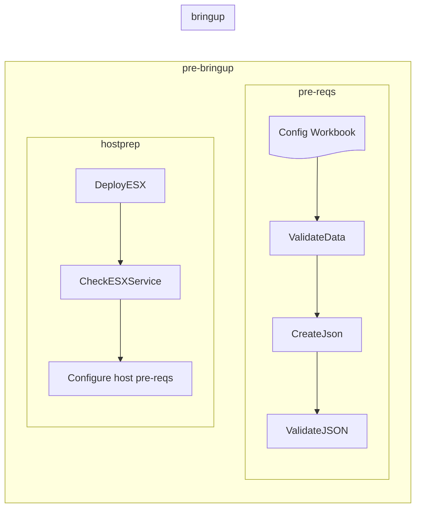

VCF

```mermaid
    flowchart LR
        subgraph pre-bringup
            subgraph pre-reqs
                direction TB   
                GetBringupConfig@{ shape: doc, label: "Config Workbook"} --> ValidateData --> CreateJson --> ValidateJSON
            end
            subgraph hostprep
                direction TB
                DeployESX --> CheckESXService --> HostConfig@{ shape: process, label: "Configure host pre-reqs"}
            end
        end

        subgraph bringup
            
        end
```

C -->|One| D[Result one]
    C -->|Two| E[Result two]

